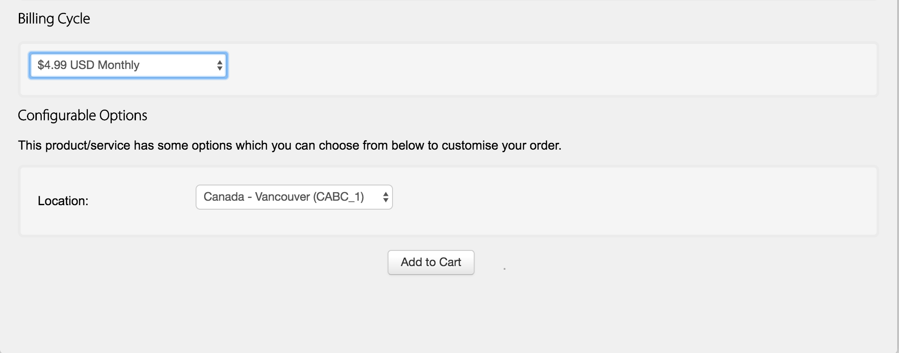
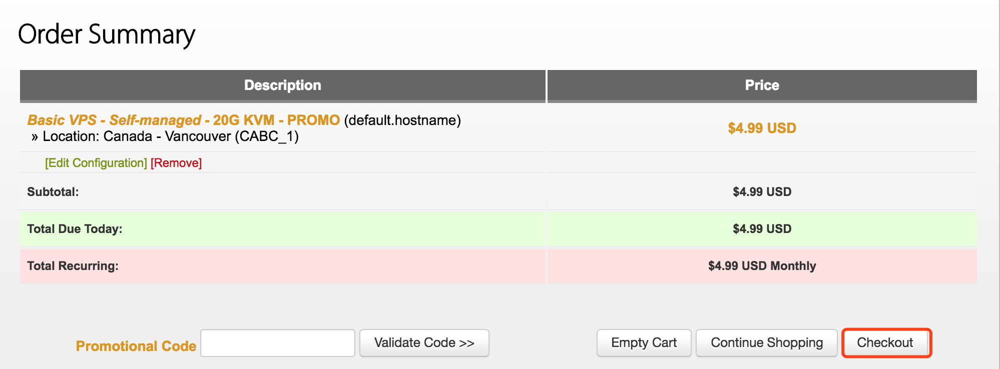
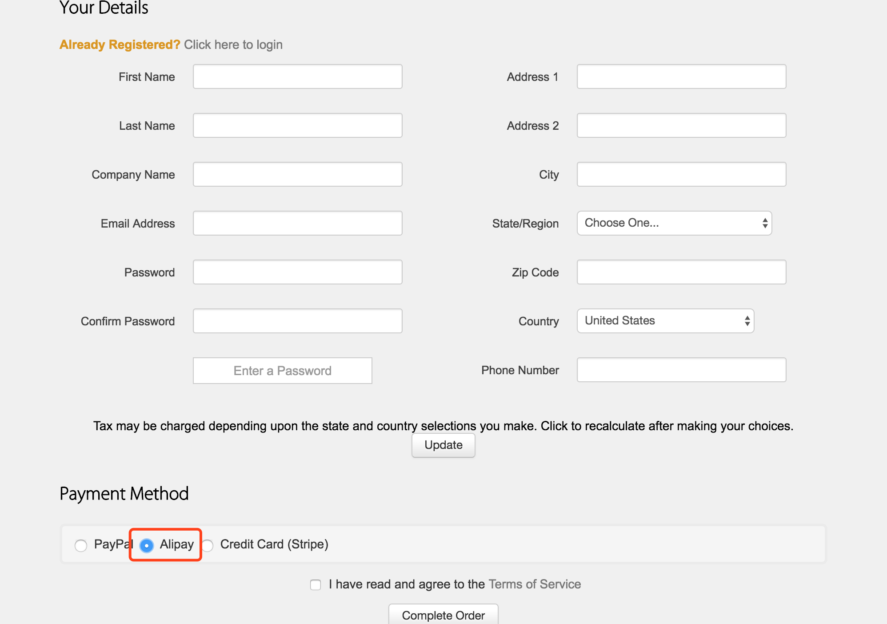

# Sitebuilding-VPS

基于[Centos7](https://www.centos.org/), [VPS], 搭建一个服务端为[Nodejs](https://nodejs.org/zh-cn/), 数据库为[MySql](https://www.mysql.com/cn/), 
服务器为[Nginx](https://nginx.org/en/)的站点

>由于自己在业余时间学习了egg（nodejs 框架），并且写了一个前后端分离的项目，继续往后打算将其部署在线上运行，于是乎一条采坑之旅又开始了。。。

## Feature

- Centos7
- VPS
- Nodejs
- Nginx
- MySql

## Objective

- 在线上访问自己的个人网站（Done）http://97.64.43.217/pinellia/#/

## Steps
### 1. 购买VPS
[VPS](https://zh.wikipedia.org/wiki/%E8%99%9A%E6%8B%9F%E4%B8%93%E7%94%A8%E6%9C%8D%E5%8A%A1%E5%99%A8),不知道的童鞋可以先看下网上的定义。然后Google收了一下，有很多，大多是要收费的，考虑到日后要加上翻墙功能，也不想着去备案什么的，首先排除掉了国内的。再加上自己没有visa等国际信用卡，最终选择了[搬瓦工](https://bandwagonhost.com/)(支持支付宝直接付款，对于小白来说方便了不少)。

可以看到有各种配置的选择，个人建站的话，选择最低配的完全够了（自己选的$4.99的那个，因为最低的没有货了）。至于KVM和OVZ的区别就没有研究过了，直接选的KVM。

可以选择支付方式（因为第一次搞这个，没把握，所以只买了一个月的先尝试一下），一次买一年的话会有优惠。服务器位置的话默认加拿大🇨🇦的，没有动过，当然也可以选择其他的。设置好后加入购入车就行。

选择checkout付款。

没有登录搬瓦工账号的话，需要先填写一些注册账户的信息，填写完之后，支付方式选择Alipay(支付宝)，然后就跟淘宝购物一样，出现二维码，付款就行。
购买成功后账号，注意查收邮件，会把账单信息和VPS信息发到你邮箱。至此，VPS购买完成！！！！
