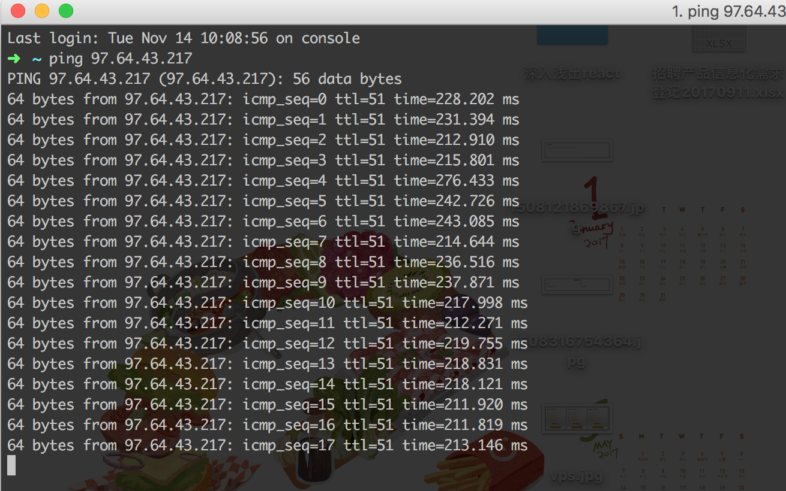
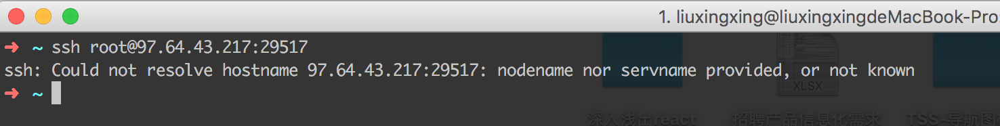
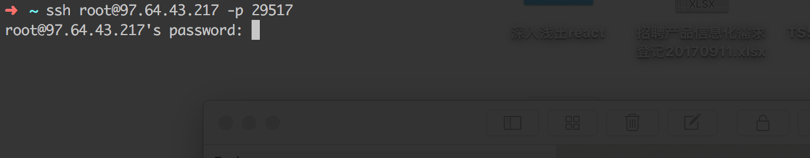
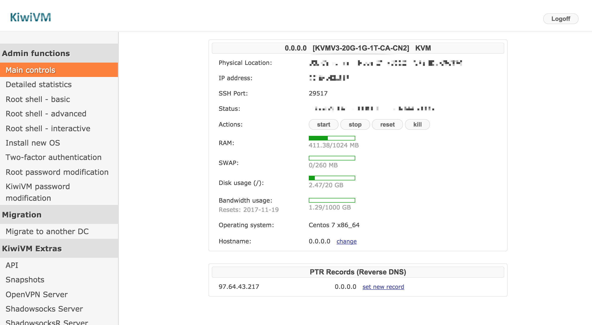
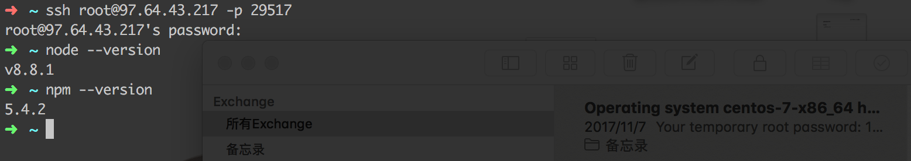
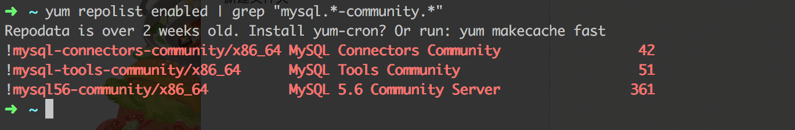
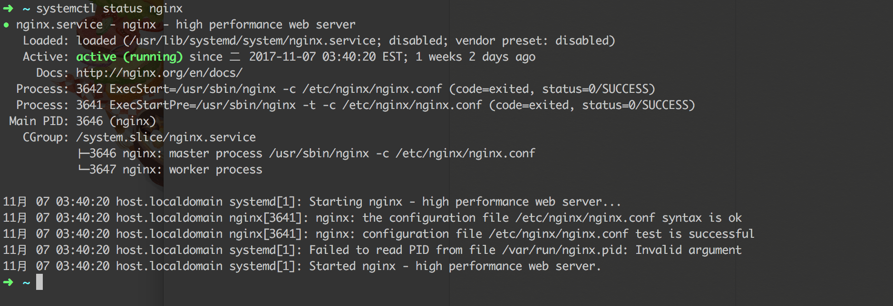
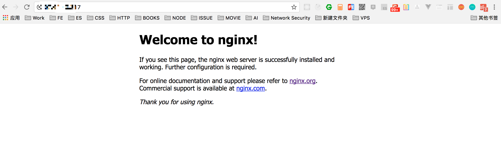

# Sitebuilding-VPS

基于[Centos7](https://www.centos.org/)， [VPS]， 搭建一个支持[Nodejs](https://nodejs.org/zh-cn/)，[MySql](https://www.mysql.com/cn/)，服务器为[Nginx](https://nginx.org/en/)的站点用来部署自己的个人项目和最重要的翻墙！翻墙！！翻墙！！！（毕竟外面的世界更精彩😊）

- 由于自己在业余时间学习了egg（nodejs 框架），并且写了一个前后端分离的项目，继续往后打算将其部署在线上运行，于是乎一条采坑之旅又开始了。。。
- 某大会直接导致一大片VPN服务被封下线，如何科学上网成为重中之重！

## Feature

- Centos7
- VPS
- Nodejs
- Nginx
- MySql

## Objective

- 在线上访问自己的个人网站（Done）http://97.64.43.217/pinellia/#/

## Steps
### 1. 购买VPS
[VPS](https://zh.wikipedia.org/wiki/%E8%99%9A%E6%8B%9F%E4%B8%93%E7%94%A8%E6%9C%8D%E5%8A%A1%E5%99%A8),不知道的童鞋可以先看下网上的定义。然后Google收了一下，有很多，大多是要收费的，考虑到日后要加上翻墙功能，也不想着去备案什么的，首先排除掉了国内的。再加上自己没有visa等国际信用卡，最终选择了[搬瓦工](https://bandwagonhost.com/)(支持支付宝直接付款，对于小白来说方便了不少)。


可以看到有各种配置的选择，个人建站的话，选择最低配的完全够了（自己选的$4.99的那个，因为最低的没有货了）。至于KVM和OVZ的区别就没有研究过了，直接选的KVM。


可以选择支付方式（因为第一次搞这个，没把握，所以只买了一个月的先尝试一下），一次买一年的话会有优惠。服务器位置的话默认加拿大🇨🇦的，没有动过，当然也可以选择其他的。设置好后加入购入车就行。


选择checkout付款。


没有登录搬瓦工账号的话，需要先填写一些注册账户的信息，填写完之后，支付方式选择Alipay(支付宝)，然后就跟淘宝购物一样，出现二维码，付款就行。
购买成功后账号，注意查收邮件，会把账单信息和VPS信息发到你邮箱。至此，VPS购买完成！！！！

### 2. 连接服务器
购买成功后就可以尝试连接了。



在终端中ping一下，出现上面的结果表示，服务器已经启动了。一切准备就绪之后就可以尝试ssh连接了。




这个地方有个坑，如果采用第一种方法连接会报错，具体原因没有了解过，然后尝试第二种方法是完全可以连接的，输入密码就能连接服务器了。



搬瓦工有个比较好的地方就是他有个KiwiVM操作面板，可以通过登录这个面板进行服务器上的一些操作，包括给服务器安装操作系统等，都是一键操作的，（这里是选择了centos7）。还有个非常实用的功能就是一键搭建SSR，SR 服务，直接可以用来翻墙！！非常之方便。

### 3. 搭建环境
前面说到了，这里是以centos7为操作系统来搭建服务器环境，centos7是通过yum来进行安装包管理。

#### 安装node

Alternatively for Node.js 8:
```
curl --silent --location https://rpm.nodesource.com/setup_8.x | sudo bash -
```

Then install:
```
sudo yum -y install nodejs
```



出现node和npm当前版本号，说明node安装成功。

#### 安装mySql

mySql的安装要复杂一点：通过yum安装, 因为yum上面没有mySql包，所以直接yum install mySql是不行的，必须要把mySql的下载源加入到yum中。


- 下载mysql源安装包
```
wget http://dev.mysql.com/get/mysql57-community-release-el7-8.noarch.rpm
```

- 安装mysql源
```
yum localinstall mysql57-community-release-el7-8.noarch.rpm
```

- 检查mysql源是否安装成功
```
yum repolist enabled | grep "mysql.--community.-"
```

出现上图情况，表明mySql安装源配置成功

- 安装MySQL服务

```
yum install mysql-community-server
```

- 启动MySQL服务
```
systemctl start mysqld
```

- 查看MySQL服务
```
systemctl status mysqld
```

- 停止MySQL服务
```
systemctl stop mysqld
```

- 开机启动
```
systemctl enable mysqld
systemctl daemon-reload
```

#### 安装nginx
通过yum安装, 过程和安装mySql差不多：

- 添加nginx的下载源
```
sudo rpm -Uvh http://nginx.org/packages/centos/7/noarch/RPMS/nginx-release-centos-7-0.el7.ngx.noarch.rpm
```

- 安装nginx服务
```
sudo yum install -y nginx
```

- 启动nginx服务
```
sudo systemctl start nginx.service
```

- 查看nginx服务
```
sudo systemctl status nginx.service
```


如上图，表示nginx正在运行中，这个时候可以直接在浏览器中访问服务器ip



出现上图，说明服务器nginx启动成功。

- 停止nginx服务
```
sudo systemctl stop nginx.service
```

- 自动启动nginx
```
sudo systemctl enable nginx
```

- nginx默认站点根路径
```
/usr/share/nginx/html
```

- nginx默认站点配置路径
```
/etc/nginx/conf.d/default.conf
```

- Nginx 主配置如下
```
/etc/nginx/nginx.conf
```

至此，站点需要的基本环境已经搭建完成，接下来就可以进行代码的部署与访问了！！！